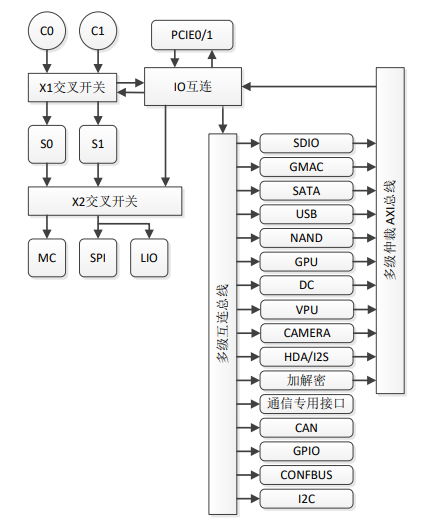

# [2K1000](https://doc.soc.xin/2K1000)

* [loongson](https://www.loongson.cn/): [LoongArch](https://github.com/SoCXin/LoongArch)
* [L6R6](https://github.com/SoCXin/Level): 2x 1.0 GHz 

## [简介](https://github.com/SoCXin/2K1000)

[2K1000](https://www.loongson.cn/product/show?id=8) 主要面向于网络应用，兼顾平板应用及工控领域应用。片内集成 2 个 LA264 处理器核，主频 1GHz，64 位 DDR3控制器，以及各种系统 IO 接口。

### 关键参数

* 集成两个 64 位的双发射超标量 LA264 处理器核，主频 1GHz
* 集成共享的 1MB 二级 Cache
* 集成 GPU
* 双路 DVO 显示
* 集成 64 位 533MHz 的 DDR3 控制器
* 集成 2 个 x4 PCIE2.0 接口；可以拆分为 6 个独立 x1 接口
* 集成 1 个 SATA2.0 接口
* 集成 4 个 USB2.0 接口
* 集成 2 个 RGMII 千兆网接口

### [资源收录](https://github.com/SoCXin)

* [参考资源](src/)
* [参考文档](docs/)
* [参考工程](project/)

### [选型建议](https://github.com/SoCXin/2K1000)

[2K1000](https://github.com/SoCXin/2K1000)

### [www.SoC.xin](http://www.SoC.Xin)
